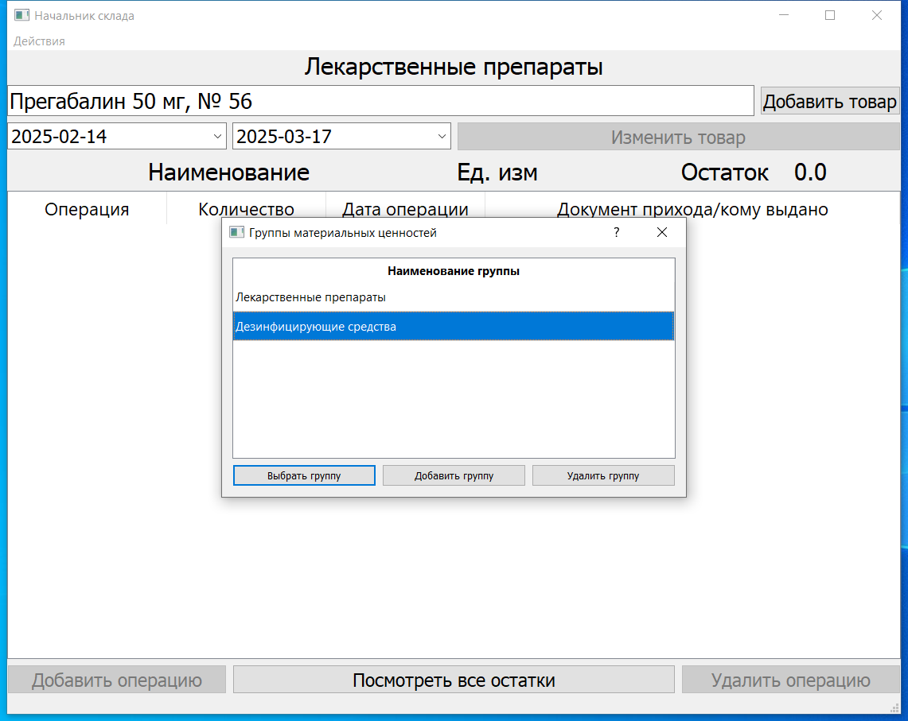

# Учет материальных ценностей
Десктопное приложение для учета материальных ценностей в аптечной организации на **Python, Qt5 и SQLlite3**
### **Функции:**
1. Импортирование данных в базу программы из форматов `.xlsx`, `.ods`;
1. Создание отдельных групп материальных ценностей;
1. Быстрый поиск учётных единиц с автозаполнением и редактирование
1. Добавление операций по приходу-выбытию;
1. Автоматическая генерация остатков складских запасов, а также их экспорт в форматы `.docx` и `.odt`;
1. Отображение информации об операциях с фильтрацией по дате

### Снимки экрана

